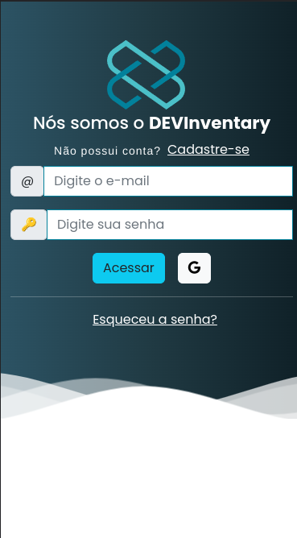

<h1 align="center">
    
</h1>

<p align="center">
  <a href="https://devinventary.netlify.app">
    
  </a>
 

</p>

# 💻 Sobre o projeto

<p align="left">Este projeto foi criado para avaliação final do Módulo 01 do curso DEVInHouse em parceria com ACATE e ConectaNuvem. Foram utilizados os conhecimentos adquiridos nas primeiras doze semanas do curso.

A ideia do projeto consiste na construção de uma aplicação com o framework Vue JS para uma ** Single Page Application** de Inventário com a finalidade de controlar o empréstimo de itens aos colaboradores. Para alcançar o resultado almejado, os seguintes aprendizados foram aplicados na confecção do projeto:

- HTML: uso das principais tags como head, meta, title, body, div, h1, form, input, button, ul, li. Atributos de tags como class, id, type. Inclusão de arquivos de estilos (css) e de script (js) na página.
- CSS/SASS: estilização da página, botões, inputs, alteração de atributos dos elementos da tela de acordo com a interação do usuário, (UX), responsividade a diferentes tamanhos de telas (mobile📱/web💻)
- Vue JS / Javascript: vue router, vuex, axios, variáveis, arrays, funções síncronas e assíncronas, manipulação do DOM (eventos, elementos e seus atributos), manipulação de objetos (JSON), utilização do localStorage, uso de bibliotecas Javascript.
- Versionamento: utilização do github como ferramenta de versionamento, utilizando os conceitos de gitflow.

O projeto finalizado pode ser conferido no link: <a href>https://devinventary.netlify.app/

</p>

# ⚙️ Instalação

## IDE recomendada

[VSCode](https://code.visualstudio.com/) + [Volar](https://marketplace.visualstudio.com/items?itemName=johnsoncodehk.volar) (necessário desabilitar o Vetur) + [TypeScript Vue Plugin (Volar)](https://marketplace.visualstudio.com/items?itemName=johnsoncodehk.vscode-typescript-vue-plugin).

## Setup do Projeto

```bash
# Clone este repositório
$ git clone https://github.com/edumartinsrib/DEVInventary.git
```

### Instale as dependências

```sh
npm install
```

### Compilação para desenvolvimento

```sh
npm run dev
```

### Compilação e Build do projeto

```sh
npm run build
```

# 📝 Funcionalidades

As seguintes funcionalidades foram implementadas:

- Registro e logins de usuários com validação;
- Dashboard com estatísticas do sistema e ferramentas de pesquisa;
- View para adição/edição e listagem de colaboradores;
- View para adição/edição e listagem de itens;
- Possibilidade de empréstimo de itens para colaboradores;

# 🎨 Layout

<p> O aplicativo foi criado sob o conceito de design responsivo mobile first, de modo a atender diversos tamanhos de telas.</p>

## Mobile 📱

<p align="left">
  
</p>

## Web 💻

<p align="left">
  
</p>

# 🖥️ Tecnologias utilizadas:

- Vue.JS;
- JavaScript;
- HTML;
- CSS;
- SASS;
- Bootstrap.

# 🧑‍💻 Autor:

**Eduardo Martins Ribeiro** - [Linkedin](https://www.linkedin.com/in/edumrib/ "Eduardo Martins Ribeiro") - [Email](mailto:edumartinsrib@live.com?subject=ola "Olá!")

# 🤝 Agradecimentos:

A realização deste projeto apenas foi possível em razão do excelente ensino disponibilizado por toda a equipe DEVInHouse e ConectaNuvem. Em especial, meus sinceros agradecimentos a:

- Gilmar Bennet
- Cesar Abascal
- André Leão
- ConectaNuvem
- E demais membros da Equipe DEVInHouse
